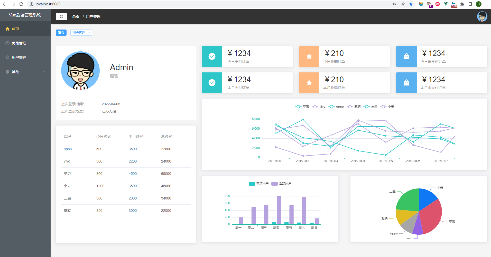
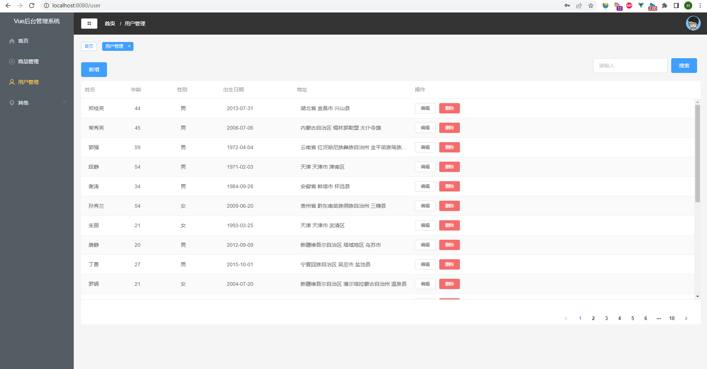

这是feature分支，在master分支的基础上解决一些问题。

> master分支是我跟着教程做出的原始版，为了方便其它同学参考，master分支就不改动了，尽量和教程里一致。
>
> 在实践过程中也发现了一些问题，所以都改动在feature分支里。

# 问题记录

- [x] 点击触发重复路由时控制台报错：`NavigationDuplicated: Avoided redundant navigation to current location: "/".`


# vue-management-demo

感谢[Allen](https://space.bilibili.com/1643315584)老师的[视频教程](https://www.bilibili.com/video/BV1QU4y1E7qo)。

这是一个 Vue + Element UI 的练习项目。

效果图：

首页



用户管理




## Project setup
```
yarn install
```

### Compiles and hot-reloads for development
```
yarn serve
```

### Compiles and minifies for production
```
yarn build
```

### Lints and fixes files
```
yarn lint
```

### Customize configuration
See [Configuration Reference](https://cli.vuejs.org/config/).
